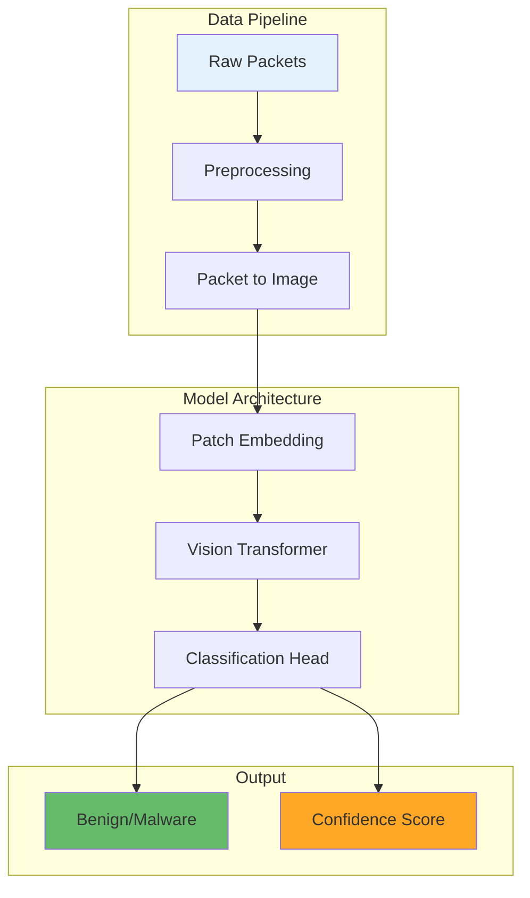

# Diagram and Visualization Standards

## Overview
This guide establishes standards for creating consistent, informative visualizations and diagrams throughout the Vision Transformer Network Traffic Analysis project documentation.

## General Principles

1. **Clarity First**: Prioritize understanding over aesthetics
2. **Consistency**: Use uniform styles across all materials
3. **Accessibility**: Consider colorblind-friendly palettes
4. **Reproducibility**: Include code to generate all figures
5. **Context**: Always caption and explain visualizations

## Color Palette Standards

### Primary Colors
```python
# Define project color palette
COLORS = {
    # Primary colors
    'benign': '#2E7D32',      # Green - Safe/Benign traffic
    'malware': '#D32F2F',     # Red - Malicious traffic
    'unknown': '#757575',     # Gray - Unknown/Uncertain
    
    # Secondary colors
    'highlight': '#FFA726',   # Orange - Emphasis
    'info': '#29B6F6',       # Light Blue - Information
    'success': '#66BB6A',    # Light Green - Success
    'warning': '#FFCA28',    # Yellow - Warning
    
    # Gradient colors for heatmaps
    'gradient_start': '#E3F2FD',  # Light blue
    'gradient_end': '#0D47A1',    # Dark blue
}

# Colorblind-friendly palette
COLORBLIND_SAFE = ['#1f77b4', '#ff7f0e', '#2ca02c', '#d62728', 
                   '#9467bd', '#8c564b', '#e377c2', '#7f7f7f']
```

## Architecture Diagrams

### 1. System Architecture
Use Mermaid for inline diagrams in documentation:



### 2. Model Architecture (Python)
```python
import matplotlib.pyplot as plt
import matplotlib.patches as mpatches
from matplotlib.patches import FancyBboxPatch, ConnectionPatch

def draw_vit_architecture():
    """Draw Vision Transformer architecture diagram."""
    fig, ax = plt.subplots(1, 1, figsize=(14, 8))
    
    # Component positions
    components = {
        'input': (1, 6, 1.5, 1),
        'patch_embed': (3, 6, 1.5, 1),
        'pos_embed': (3, 4.5, 1.5, 0.5),
        'transformer': (5.5, 5.25, 2, 2.5),
        'mlp_head': (8.5, 6, 1.5, 1),
        'output': (11, 6, 1.5, 1)
    }
    
    # Draw components
    for name, (x, y, w, h) in components.items():
        if name == 'transformer':
            # Special styling for transformer block
            box = FancyBboxPatch((x, y), w, h,
                               boxstyle="round,pad=0.1",
                               facecolor='#E8F5E9',
                               edgecolor='#4CAF50',
                               linewidth=2)
        else:
            box = FancyBboxPatch((x, y), w, h,
                               boxstyle="round,pad=0.05",
                               facecolor='#F5F5F5',
                               edgecolor='#616161',
                               linewidth=1.5)
        ax.add_patch(box)
        
        # Add labels
        labels = {
            'input': 'Input\n(224×224)',
            'patch_embed': 'Patch\nEmbedding',
            'pos_embed': 'Position',
            'transformer': 'Transformer\nEncoder\n(12 layers)',
            'mlp_head': 'MLP\nHead',
            'output': 'Output\n(2 classes)'
        }
        ax.text(x + w/2, y + h/2, labels[name],
                ha='center', va='center', fontsize=11, weight='bold')
    
    # Draw connections
    connections = [
        ('input', 'patch_embed'),
        ('patch_embed', 'transformer'),
        ('pos_embed', 'transformer'),
        ('transformer', 'mlp_head'),
        ('mlp_head', 'output')
    ]
    
    for start, end in connections:
        x1, y1, w1, h1 = components[start]
        x2, y2, w2, h2 = components[end]
        
        if start == 'pos_embed':
            # Special connection from position embedding
            arrow = ConnectionPatch((x1 + w1/2, y1), (x2, y2 + h2/2),
                                  "data", "data",
                                  arrowstyle="->",
                                  shrinkA=0, shrinkB=0,
                                  color='#757575',
                                  linewidth=1.5)
        else:
            arrow = ConnectionPatch((x1 + w1, y1 + h1/2), (x2, y2 + h2/2),
                                  "data", "data",
                                  arrowstyle="->",
                                  shrinkA=0, shrinkB=0,
                                  color='#424242',
                                  linewidth=2)
        ax.add_artist(arrow)
    
    # Add annotations
    ax.text(5.5, 3, 'Multi-Head\nSelf-Attention', 
            ha='center', fontsize=9, style='italic', color='#616161')
    ax.text(7.5, 3, 'Feed\nForward', 
            ha='center', fontsize=9, style='italic', color='#616161')
    
    # Styling
    ax.set_xlim(0, 13)
    ax.set_ylim(2, 9)
    ax.axis('off')
    ax.set_title('Vision Transformer Architecture for Packet Classification',
                fontsize=16, weight='bold', pad=20)
    
    plt.tight_layout()
    return fig
```

## Data Visualizations

### 1. Packet Distribution
```python
def plot_packet_distribution(packet_lengths, labels):
    """Visualize packet length distribution by class."""
    fig, (ax1, ax2) = plt.subplots(1, 2, figsize=(14, 6))
    
    # Histogram
    benign_lengths = packet_lengths[labels == 0]
    malware_lengths = packet_lengths[labels == 1]
    
    ax1.hist(benign_lengths, bins=50, alpha=0.7, 
             color=COLORS['benign'], label='Benign', density=True)
    ax1.hist(malware_lengths, bins=50, alpha=0.7,
             color=COLORS['malware'], label='Malware', density=True)
    
    ax1.set_xlabel('Packet Length (bytes)', fontsize=12)
    ax1.set_ylabel('Density', fontsize=12)
    ax1.set_title('Packet Length Distribution', fontsize=14, weight='bold')
    ax1.legend()
    ax1.grid(True, alpha=0.3)
    
    # Box plot
    data_to_plot = [benign_lengths, malware_lengths]
    bp = ax2.boxplot(data_to_plot, labels=['Benign', 'Malware'],
                     patch_artist=True, notch=True)
    
    colors = [COLORS['benign'], COLORS['malware']]
    for patch, color in zip(bp['boxes'], colors):
        patch.set_facecolor(color)
        patch.set_alpha(0.7)
    
    ax2.set_ylabel('Packet Length (bytes)', fontsize=12)
    ax2.set_title('Packet Length by Class', fontsize=14, weight='bold')
    ax2.grid(True, alpha=0.3, axis='y')
    
    plt.suptitle('Network Packet Characteristics', fontsize=16, weight='bold')
    plt.tight_layout()
    return fig
```

### 2. Encoding Comparison
```python
def visualize_encoding_methods(packet_bytes):
    """Compare different encoding methods side by side."""
    fig, axes = plt.subplots(2, 3, figsize=(15, 10))
    axes = axes.ravel()
    
    methods = ['sequential', 'hilbert', 'spiral', 'zigzag', 'random', 'block']
    
    for idx, method in enumerate(methods):
        # Generate encoded image
        image = encode_packet(packet_bytes, method=method, size=64)
        
        # Plot
        im = axes[idx].imshow(image, cmap='viridis', interpolation='nearest')
        axes[idx].set_title(f'{method.capitalize()} Encoding', 
                           fontsize=12, weight='bold')
        axes[idx].set_xlabel('X coordinate')
        axes[idx].set_ylabel('Y coordinate')
        
        # Add colorbar
        cbar = plt.colorbar(im, ax=axes[idx], fraction=0.046)
        cbar.set_label('Byte Value', fontsize=10)
    
    plt.suptitle('Packet-to-Image Encoding Methods Comparison',
                fontsize=16, weight='bold')
    plt.tight_layout()
    return fig
```

### 3. Attention Visualization
```python
def plot_attention_heatmap(attention_weights, packet_image, patch_size=16):
    """Visualize attention weights overlaid on packet image."""
    fig, (ax1, ax2, ax3) = plt.subplots(1, 3, figsize=(18, 6))
    
    # Original packet image
    ax1.imshow(packet_image, cmap='gray', interpolation='nearest')
    ax1.set_title('Original Packet Image', fontsize=14, weight='bold')
    ax1.set_xlabel('Pixel X')
    ax1.set_ylabel('Pixel Y')
    
    # Attention heatmap
    # Reshape attention to match image patches
    num_patches = int(np.sqrt(attention_weights.shape[0]))
    attention_map = attention_weights.reshape(num_patches, num_patches)
    
    # Upsample to match image size
    attention_resized = np.kron(attention_map, 
                               np.ones((patch_size, patch_size)))
    
    im2 = ax2.imshow(attention_resized, cmap='hot', interpolation='bilinear')
    ax2.set_title('Attention Weights', fontsize=14, weight='bold')
    ax2.set_xlabel('Pixel X')
    ax2.set_ylabel('Pixel Y')
    plt.colorbar(im2, ax=ax2, label='Attention Score')
    
    # Overlay
    ax3.imshow(packet_image, cmap='gray', interpolation='nearest', alpha=0.7)
    im3 = ax3.imshow(attention_resized, cmap='hot', interpolation='bilinear', 
                     alpha=0.5)
    ax3.set_title('Attention Overlay', fontsize=14, weight='bold')
    ax3.set_xlabel('Pixel X')
    ax3.set_ylabel('Pixel Y')
    
    # Add grid to show patches
    for i in range(0, packet_image.shape[0], patch_size):
        ax3.axhline(i, color='white', linewidth=0.5, alpha=0.5)
        ax3.axvline(i, color='white', linewidth=0.5, alpha=0.5)
    
    plt.suptitle('Vision Transformer Attention Analysis',
                fontsize=16, weight='bold')
    plt.tight_layout()
    return fig
```

## Performance Visualizations

### 1. Training Metrics
```python
def plot_training_history(history):
    """Plot training and validation metrics."""
    fig, ((ax1, ax2), (ax3, ax4)) = plt.subplots(2, 2, figsize=(14, 10))
    
    epochs = range(1, len(history['train_loss']) + 1)
    
    # Loss plot
    ax1.plot(epochs, history['train_loss'], 'b-', label='Training Loss')
    ax1.plot(epochs, history['val_loss'], 'r--', label='Validation Loss')
    ax1.set_xlabel('Epoch')
    ax1.set_ylabel('Loss')
    ax1.set_title('Model Loss', fontsize=14, weight='bold')
    ax1.legend()
    ax1.grid(True, alpha=0.3)
    
    # Accuracy plot
    ax2.plot(epochs, history['train_acc'], 'b-', label='Training Accuracy')
    ax2.plot(epochs, history['val_acc'], 'r--', label='Validation Accuracy')
    ax2.set_xlabel('Epoch')
    ax2.set_ylabel('Accuracy')
    ax2.set_title('Model Accuracy', fontsize=14, weight='bold')
    ax2.legend()
    ax2.grid(True, alpha=0.3)
    
    # Learning rate schedule
    if 'lr' in history:
        ax3.plot(epochs, history['lr'], 'g-', linewidth=2)
        ax3.set_xlabel('Epoch')
        ax3.set_ylabel('Learning Rate')
        ax3.set_title('Learning Rate Schedule', fontsize=14, weight='bold')
        ax3.set_yscale('log')
        ax3.grid(True, alpha=0.3)
    
    # F1 score
    if 'f1_score' in history:
        ax4.plot(epochs, history['train_f1'], 'b-', label='Training F1')
        ax4.plot(epochs, history['val_f1'], 'r--', label='Validation F1')
        ax4.set_xlabel('Epoch')
        ax4.set_ylabel('F1 Score')
        ax4.set_title('F1 Score', fontsize=14, weight='bold')
        ax4.legend()
        ax4.grid(True, alpha=0.3)
    
    plt.suptitle('Training History', fontsize=16, weight='bold')
    plt.tight_layout()
    return fig
```

### 2. Confusion Matrix
```python
def plot_confusion_matrix(y_true, y_pred, classes=['Benign', 'Malware']):
    """Create an enhanced confusion matrix visualization."""
    from sklearn.metrics import confusion_matrix
    import seaborn as sns
    
    # Calculate confusion matrix
    cm = confusion_matrix(y_true, y_pred)
    
    # Calculate percentages
    cm_percent = cm.astype('float') / cm.sum(axis=1)[:, np.newaxis] * 100
    
    # Create figure
    fig, ax = plt.subplots(figsize=(8, 6))
    
    # Create heatmap
    sns.heatmap(cm, annot=False, fmt='d', cmap='Blues', 
                square=True, cbar=False, ax=ax)
    
    # Add custom annotations with counts and percentages
    for i in range(len(classes)):
        for j in range(len(classes)):
            text = f'{cm[i,j]}\n({cm_percent[i,j]:.1f}%)'
            color = 'white' if cm_percent[i,j] > 50 else 'black'
            ax.text(j + 0.5, i + 0.5, text,
                   ha='center', va='center', color=color,
                   fontsize=12, weight='bold')
    
    # Labels and styling
    ax.set_xlabel('Predicted Label', fontsize=14, weight='bold')
    ax.set_ylabel('True Label', fontsize=14, weight='bold')
    ax.set_xticklabels(classes, fontsize=12)
    ax.set_yticklabels(classes, fontsize=12)
    ax.set_title('Confusion Matrix', fontsize=16, weight='bold', pad=20)
    
    # Add metrics
    accuracy = np.trace(cm) / np.sum(cm)
    ax.text(0.5, -0.15, f'Overall Accuracy: {accuracy:.2%}',
            transform=ax.transAxes, ha='center', fontsize=12)
    
    plt.tight_layout()
    return fig
```

## Interactive Visualizations

### 1. Plotly for Interactive Plots
```python
import plotly.graph_objects as go
from plotly.subplots import make_subplots

def create_interactive_performance_plot(results_df):
    """Create interactive performance comparison plot."""
    fig = make_subplots(
        rows=2, cols=2,
        subplot_titles=('Accuracy by Model', 'F1 Score by Model',
                       'Inference Time', 'Model Complexity'),
        specs=[[{'type': 'bar'}, {'type': 'bar'}],
               [{'type': 'scatter'}, {'type': 'scatter'}]]
    )
    
    # Accuracy comparison
    fig.add_trace(
        go.Bar(x=results_df['model'], y=results_df['accuracy'],
               marker_color=COLORBLIND_SAFE[:len(results_df)],
               text=results_df['accuracy'].round(3),
               textposition='outside'),
        row=1, col=1
    )
    
    # F1 Score comparison
    fig.add_trace(
        go.Bar(x=results_df['model'], y=results_df['f1_score'],
               marker_color=COLORBLIND_SAFE[:len(results_df)],
               text=results_df['f1_score'].round(3),
               textposition='outside'),
        row=1, col=2
    )
    
    # Inference time
    fig.add_trace(
        go.Scatter(x=results_df['model'], y=results_df['inference_ms'],
                  mode='markers+lines',
                  marker=dict(size=10, color=COLORS['info']),
                  line=dict(color=COLORS['info'], width=2)),
        row=2, col=1
    )
    
    # Model complexity (parameters)
    fig.add_trace(
        go.Scatter(x=results_df['model'], y=results_df['parameters'],
                  mode='markers',
                  marker=dict(size=results_df['parameters']/1e6 + 10,
                            color=COLORS['warning'],
                            showscale=False)),
        row=2, col=2
    )
    
    # Update layout
    fig.update_layout(
        title_text="Model Performance Comparison Dashboard",
        title_font_size=20,
        showlegend=False,
        height=800
    )
    
    # Update axes
    fig.update_yaxes(title_text="Accuracy", row=1, col=1)
    fig.update_yaxes(title_text="F1 Score", row=1, col=2)
    fig.update_yaxes(title_text="Inference Time (ms)", row=2, col=1)
    fig.update_yaxes(title_text="Parameters", row=2, col=2)
    
    return fig
```

### 2. Animation for Attention Evolution
```python
import matplotlib.animation as animation
from IPython.display import HTML

def animate_attention_evolution(attention_history, packet_image):
    """Animate how attention changes across transformer layers."""
    fig, ax = plt.subplots(figsize=(8, 8))
    
    # Initial setup
    im_packet = ax.imshow(packet_image, cmap='gray', alpha=0.7)
    im_attention = ax.imshow(attention_history[0], cmap='hot', 
                            alpha=0.5, interpolation='bilinear')
    
    title = ax.set_title('Layer 0', fontsize=16, weight='bold')
    ax.set_xlabel('Pixel X')
    ax.set_ylabel('Pixel Y')
    
    # Colorbar
    cbar = plt.colorbar(im_attention, ax=ax, label='Attention Weight')
    
    def animate(frame):
        im_attention.set_data(attention_history[frame])
        title.set_text(f'Layer {frame}')
        return [im_attention, title]
    
    anim = animation.FuncAnimation(
        fig, animate, frames=len(attention_history),
        interval=500, blit=True, repeat=True
    )
    
    plt.close()
    return HTML(anim.to_jshtml())
```

## Documentation Diagrams

### 1. Process Flow
```python
def create_process_flow():
    """Create process flow diagram using networkx."""
    import networkx as nx
    
    fig, ax = plt.subplots(figsize=(12, 8))
    
    # Create directed graph
    G = nx.DiGraph()
    
    # Add nodes
    nodes = [
        ('start', 'Raw\nPackets'),
        ('filter', 'Packet\nFiltering'),
        ('extract', 'Feature\nExtraction'),
        ('encode', 'Image\nEncoding'),
        ('augment', 'Data\nAugmentation'),
        ('model', 'ViT\nModel'),
        ('predict', 'Prediction'),
        ('end', 'Classification\nResult')
    ]
    
    for node_id, label in nodes:
        G.add_node(node_id, label=label)
    
    # Add edges
    edges = [
        ('start', 'filter'),
        ('filter', 'extract'),
        ('extract', 'encode'),
        ('encode', 'augment'),
        ('augment', 'model'),
        ('model', 'predict'),
        ('predict', 'end')
    ]
    G.add_edges_from(edges)
    
    # Layout
    pos = nx.spring_layout(G, k=3, iterations=50)
    
    # Draw nodes
    nx.draw_networkx_nodes(G, pos, node_color='lightblue',
                          node_size=3000, ax=ax)
    
    # Draw edges
    nx.draw_networkx_edges(G, pos, edge_color='gray',
                          arrows=True, arrowsize=20,
                          arrowstyle='->', ax=ax)
    
    # Draw labels
    labels = nx.get_node_attributes(G, 'label')
    nx.draw_networkx_labels(G, pos, labels, font_size=10,
                           font_weight='bold', ax=ax)
    
    ax.set_title('Packet Classification Pipeline',
                fontsize=16, weight='bold')
    ax.axis('off')
    
    plt.tight_layout()
    return fig
```

## Best Practices Summary

### DO:
1. ✅ Use consistent color schemes
2. ✅ Label all axes and provide units
3. ✅ Include figure captions
4. ✅ Make figures self-contained
5. ✅ Test on different screen sizes
6. ✅ Save in vector formats when possible
7. ✅ Use high DPI for raster images

### DON'T:
1. ❌ Use default matplotlib colors
2. ❌ Overcrowd visualizations
3. ❌ Use 3D plots unnecessarily
4. ❌ Forget colorblind accessibility
5. ❌ Use pie charts for many categories
6. ❌ Make text too small
7. ❌ Use JPEG for diagrams

## Export Settings

```python
# Standard export function
def save_figure(fig, filename, formats=['png', 'svg', 'pdf']):
    """Save figure in multiple formats with proper settings."""
    for fmt in formats:
        if fmt == 'png':
            fig.savefig(f'{filename}.{fmt}', dpi=300, 
                       bbox_inches='tight', facecolor='white')
        else:
            fig.savefig(f'{filename}.{fmt}', 
                       bbox_inches='tight', facecolor='white')
    print(f"Saved {filename} in formats: {', '.join(formats)}")
```