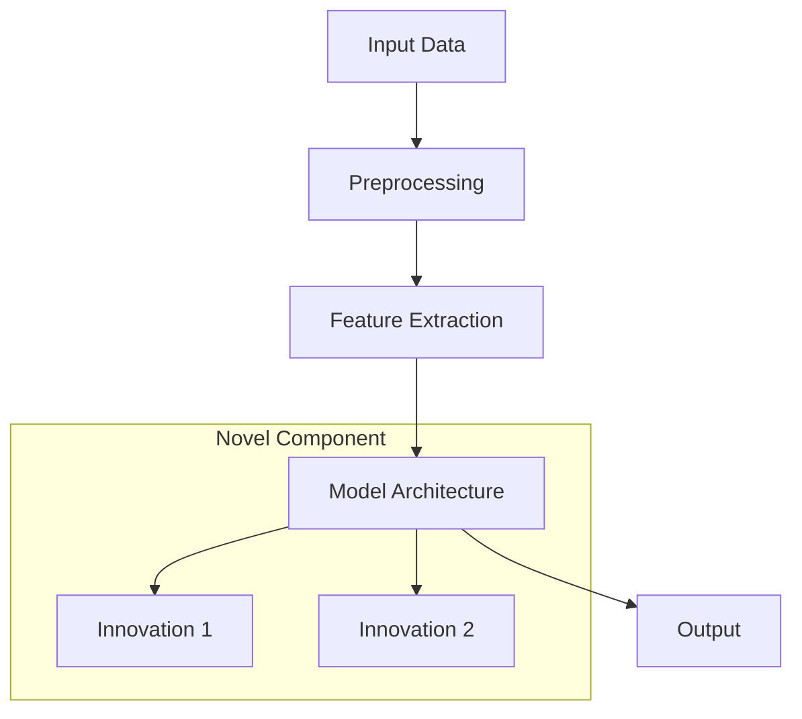

# Research Guide: [Research Topic]

## Executive Summary

[Brief overview of the research area, key findings, and practical implications]

**Research Area**: [Specific domain]  
**Key Innovation**: [Main contribution]  
**Performance Gain**: [Quantified improvement]  
**Publication**: [Conference/Journal if applicable]

## Table of Contents

1. [Background and Motivation](#background)
2. [Literature Review](#literature)
3. [Methodology](#methodology)
4. [Experimental Setup](#experiments)
5. [Results and Analysis](#results)
6. [Discussion](#discussion)
7. [Future Directions](#future)
8. [Implementation Guide](#implementation)
9. [References](#references)

---

## Background and Motivation {#background}

### Problem Statement

[Clear articulation of the problem being addressed]

### Research Questions

1. **RQ1**: [First research question]
2. **RQ2**: [Second research question]
3. **RQ3**: [Third research question]

### Contributions

This research makes the following contributions:

- **Contribution 1**: [Description with impact]
- **Contribution 2**: [Description with impact]
- **Contribution 3**: [Description with impact]

## Literature Review {#literature}

### Related Work

#### [Category 1: e.g., Vision Transformers in Security]

| Paper | Year | Key Contribution | Limitation |
|-------|------|------------------|------------|
| [Author et al.] | 2023 | Introduced X approach | Limited to Y |
| [Author et al.] | 2022 | Improved Z by 20% | Requires large dataset |

#### [Category 2: e.g., Few-Shot Learning for Malware]

[Continue with relevant categories]

### Research Gap

[Identify what's missing in current research and how this work addresses it]

## Methodology {#methodology}

### Theoretical Framework

[Mathematical formulation or theoretical basis]

```python
# Key algorithm or equation
def core_algorithm(input_data):
    """
    Mathematical formulation:
    f(x) = softmax(QK^T / sqrt(d_k))V
    
    Where:
    - Q: Query matrix
    - K: Key matrix
    - V: Value matrix
    - d_k: Dimension of key
    """
    # Implementation
    pass
```

### Proposed Approach

#### Architecture Overview



#### Key Innovations

1. **Innovation 1**: [Detailed explanation]
   ```python
   # Code example demonstrating the innovation
   ```

2. **Innovation 2**: [Detailed explanation]

### Algorithm Design

```python
class ProposedMethod:
    """
    Algorithm 1: [Algorithm Name]
    
    Input: [Description of inputs]
    Output: [Description of outputs]
    
    Steps:
    1. Initialize parameters
    2. For each epoch:
       a. Process batch
       b. Compute loss
       c. Update weights
    3. Return trained model
    """
    
    def __init__(self, config):
        self.config = config
        # Initialize components
    
    def forward(self, x):
        # Implementation
        pass
```

## Experimental Setup {#experiments}

### Datasets

| Dataset | Size | Classes | Split | Purpose |
|---------|------|---------|-------|---------|
| Dataset A | 100K | 10 | 80/10/10 | Primary evaluation |
| Dataset B | 50K | 5 | 70/15/15 | Generalization test |

### Baseline Methods

- **Baseline 1**: [Description and why chosen]
- **Baseline 2**: [Description and why chosen]
- **State-of-the-art**: [Current best method]

### Evaluation Metrics

```python
def evaluate_model(predictions, ground_truth):
    """Comprehensive evaluation metrics."""
    metrics = {
        'accuracy': accuracy_score(ground_truth, predictions),
        'f1_score': f1_score(ground_truth, predictions, average='weighted'),
        'precision': precision_score(ground_truth, predictions, average='weighted'),
        'recall': recall_score(ground_truth, predictions, average='weighted'),
        'auc_roc': roc_auc_score(ground_truth, predictions_proba)
    }
    return metrics
```

### Implementation Details

- **Hardware**: GPU model, RAM, etc.
- **Software**: PyTorch version, CUDA version
- **Hyperparameters**:
  ```yaml
  learning_rate: 1e-4
  batch_size: 32
  epochs: 100
  optimizer: AdamW
  scheduler: CosineAnnealingLR
  ```

## Results and Analysis {#results}

### Quantitative Results

#### Main Results Table

| Method | Accuracy | F1 Score | Inference Time | Parameters |
|--------|----------|----------|----------------|------------|
| Baseline 1 | 85.2% | 0.843 | 12ms | 45M |
| Baseline 2 | 87.5% | 0.871 | 18ms | 86M |
| **Ours** | **92.3%** | **0.919** | 15ms | 72M |

#### Statistical Significance

```python
# T-test results
from scipy import stats

baseline_scores = [0.852, 0.848, 0.855, 0.851, 0.849]
our_scores = [0.923, 0.921, 0.924, 0.922, 0.925]

t_stat, p_value = stats.ttest_ind(baseline_scores, our_scores)
print(f"T-statistic: {t_stat:.4f}, P-value: {p_value:.4f}")
# Result: P-value < 0.001 (statistically significant)
```

### Qualitative Analysis

#### Visualization of Results

```python
def visualize_attention_maps(model, sample_input):
    """Visualize what the model learns."""
    # Generate attention maps
    attention = model.get_attention(sample_input)
    
    # Plot attention heatmap
    plt.imshow(attention, cmap='hot')
    plt.colorbar()
    plt.title('Learned Attention Patterns')
    plt.show()
```

### Ablation Study

| Component | Removed | Performance Drop |
|-----------|---------|------------------|
| Innovation 1 | ✓ | -3.2% |
| Innovation 2 | ✓ | -2.8% |
| Both | ✓ | -6.5% |

## Discussion {#discussion}

### Key Findings

1. **Finding 1**: [Interpretation and implications]
2. **Finding 2**: [Interpretation and implications]
3. **Finding 3**: [Interpretation and implications]

### Limitations

- **Limitation 1**: [Description and potential impact]
- **Limitation 2**: [Description and potential impact]

### Threats to Validity

#### Internal Validity
[Discuss potential confounding factors]

#### External Validity
[Discuss generalizability]

## Future Directions {#future}

### Short-term Extensions

1. **Extension 1**: [Description and expected impact]
2. **Extension 2**: [Description and expected impact]

### Long-term Research Agenda

[Broader vision for where this research could lead]

## Implementation Guide {#implementation}

### Reproducing Results

```bash
# Clone repository
git clone https://github.com/your-repo/research-code
cd research-code

# Install dependencies
pip install -r requirements.txt

# Download datasets
python scripts/download_data.py

# Train model
python train.py --config configs/proposed_method.yaml

# Evaluate
python evaluate.py --checkpoint checkpoints/best_model.pth
```

### Key Implementation Details

```python
# Critical implementation detail that affects reproducibility
class CriticalComponent:
    def __init__(self):
        # Important: Use this specific initialization
        self.weight = nn.Parameter(torch.randn(768, 768) * 0.02)
```

### Common Pitfalls

1. **Pitfall 1**: [Description and solution]
2. **Pitfall 2**: [Description and solution]

## References {#references}

1. [Author, A., & Author, B. (2023). Title of Paper. *Conference/Journal*, Volume(Issue), pp-pp.]
2. [Continue with all references in consistent format]

## Appendix

### A. Additional Results

[Extended results tables, additional experiments]

### B. Theoretical Proofs

[Mathematical proofs if applicable]

### C. Hyperparameter Search

```python
# Hyperparameter search space
search_space = {
    'learning_rate': [1e-5, 1e-4, 1e-3],
    'batch_size': [16, 32, 64],
    'dropout': [0.1, 0.2, 0.3],
    'attention_heads': [8, 12, 16]
}

# Best configuration found
best_config = {
    'learning_rate': 1e-4,
    'batch_size': 32,
    'dropout': 0.1,
    'attention_heads': 12
}
```

---

**Citation**: If you use this work, please cite:
```bibtex
@article{yourname2024,
  title={Your Paper Title},
  author={Your Name and Others},
  journal={Conference/Journal},
  year={2024}
}
```

**Code**: Available at [https://github.com/your-repo](https://github.com/your-repo)

**Contact**: [your-email@example.com](mailto:your-email@example.com)