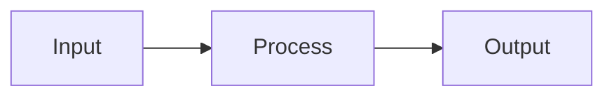

# Tutorial: [Tutorial Title]

## Overview
[Brief description of what this tutorial covers and why it's important]

**Duration**: [Estimated time to complete]  
**Level**: Beginner | Intermediate | Advanced  
**Prerequisites**: [List prerequisites]

## Learning Objectives

By completing this tutorial, you will:
- [ ] [Specific, measurable objective 1]
- [ ] [Specific, measurable objective 2]
- [ ] [Specific, measurable objective 3]

## Table of Contents

1. [Introduction](#introduction)
2. [Setting Up](#setting-up)
3. [Core Concepts](#core-concepts)
4. [Step-by-Step Implementation](#implementation)
5. [Testing and Validation](#testing)
6. [Common Issues](#common-issues)
7. [Next Steps](#next-steps)

---

## Introduction

[Provide context and background. Explain the problem this tutorial solves.]

### What You'll Build

[Describe the end result with a screenshot or diagram if applicable]

### Architecture Overview



## Setting Up

### Requirements

- Python 3.8+
- PyTorch 1.9+
- [Other requirements]

### Installation

```bash
# Clone the repository
git clone https://github.com/yourrepo/project.git
cd project

# Create virtual environment
python -m venv venv
source venv/bin/activate  # On Windows: venv\Scripts\activate

# Install dependencies
pip install -r requirements.txt
```

### Verify Installation

```python
import torch
print(f"PyTorch version: {torch.__version__}")
print(f"CUDA available: {torch.cuda.is_available()}")
```

Expected output:
```
PyTorch version: 1.9.0
CUDA available: True
```

## Core Concepts

### Concept 1: [Name]

[Explanation with simple example]

```python
# Example code demonstrating the concept
example = "code here"
```

**Key Points**:
- Point 1
- Point 2
- Point 3

### Concept 2: [Name]

[Continue with additional concepts]

## Step-by-Step Implementation

### Step 1: [Step Name]

[Explain what this step accomplishes]

```python
# Implementation code with detailed comments
def step_one():
    """
    Document what this function does.
    """
    # Step-by-step implementation
    pass
```

💡 **Tip**: [Helpful tip or best practice]

### Step 2: [Step Name]

[Continue with subsequent steps]

### Complete Implementation

Here's how all the pieces fit together:

```python
# Complete working example
class CompleteExample:
    def __init__(self):
        pass
    
    def process(self):
        pass

# Usage
example = CompleteExample()
result = example.process()
```

## Testing and Validation

### Unit Tests

```python
def test_functionality():
    """Test the implementation."""
    # Test case 1
    assert function(input1) == expected1
    
    # Test case 2
    assert function(input2) == expected2
    
    print("All tests passed! ✅")

test_functionality()
```

### Performance Verification

```python
import time

start = time.time()
# Run your implementation
result = your_function(data)
elapsed = time.time() - start

print(f"Processing time: {elapsed:.3f} seconds")
print(f"Throughput: {len(data) / elapsed:.0f} items/second")
```

## Common Issues

### Issue 1: [Error Message]

**Problem**: [Description of the problem]

**Solution**:
```python
# Corrected code
```

### Issue 2: [Error Message]

**Problem**: [Description]

**Solution**: [Explanation and fix]

## Exercises

### Exercise 1: Basic Implementation
**Task**: [Description of exercise]

**Starter Code**:
```python
def exercise_1():
    # TODO: Your implementation here
    pass
```

<details>
<summary>Solution</summary>

```python
def exercise_1():
    # Solution implementation
    return result
```
</details>

### Exercise 2: Advanced Challenge
[More challenging exercise]

## Summary

In this tutorial, you learned:
- ✅ [Key learning 1]
- ✅ [Key learning 2]
- ✅ [Key learning 3]

### Key Takeaways

| Concept | Description | Use Case |
|---------|-------------|----------|
| Concept 1 | Brief description | When to use |
| Concept 2 | Brief description | When to use |

## Next Steps

Now that you've completed this tutorial, consider:

1. **Explore Further**: Check out [Advanced Tutorial](advanced_tutorial.md)
2. **Practice**: Try the exercises in [Practice Problems](practice.md)
3. **Build**: Create your own [Project Ideas](projects.md)

## Additional Resources

### Documentation
- [API Reference](../api/reference.md)
- [Architecture Guide](../architecture/guide.md)

### External Links
- [Research Paper](https://arxiv.org/...)
- [Video Tutorial](https://youtube.com/...)
- [Community Forum](https://forum.example.com)

---

**Questions?** Open an issue on [GitHub](https://github.com/yourrepo/issues)

**Last Updated**: [Date]